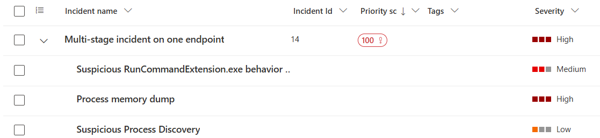
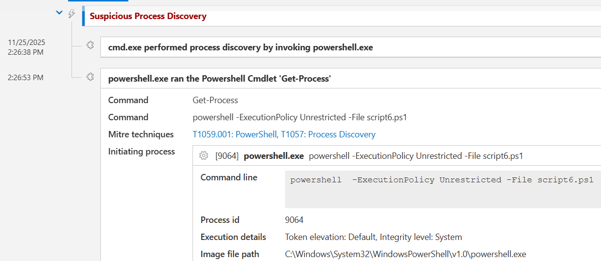
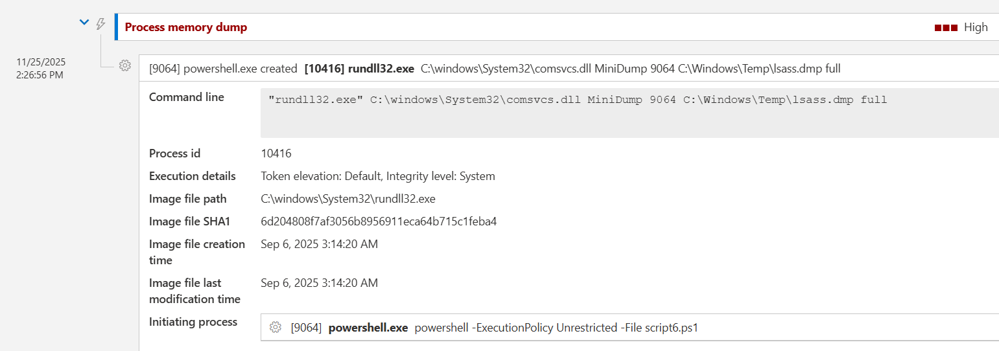
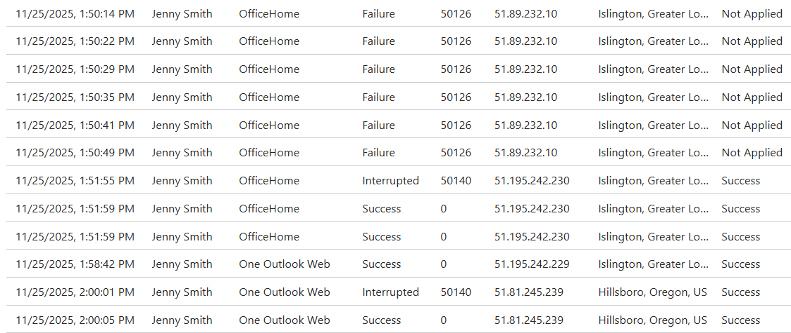

# 🛡️ Defender XDR Investigation Write-Up

## What I did in this investigation with Defender XDR

Before diving into the screenshots and alerts, here’s a quick breakdown of the techniques I carried out in this simulation. First with my red hat on to run the attack and then with my blue hat on to investigate with Defender XDR.

- Phishing Jenny to get her Microsoft 365 password.  
- Using her stolen credentials to sign in from unusual locations.  
- Running remote commands on her machine once I got access.  
- Doing basic recon like whoami, hostname and checking folders.  
- LSASS dump to steal more credentials.  
- Moving laterally to Bob’s machine.  
- Viewing Bob’s sensitive documents.  
- Copying file to C:\Windows\Temp\export.txt.  
- Encoding the file in Base64.  
- Exfiltrating the data to the attackers machine.  

I expected Defender XDR to connect the attack chain into one incident but it didn’t. Instead I had to piece the stages together myself using identity logs, device timelines and events. So here’s how I approached the investigation as a SOC Analyst.

---

My attack Kill chain has created a couple of incidents, one of them has a priority score of 100 so we better start with that one.

  

---

## Suspicious Process Discovery

I started with the first alert, Suspicious Process Discovery. When I checked the Incident Graph, the Process Tree and the the Incident Timeline, I could see that something unusual happened on Jenny’s device on **25/11/25 14:26:38 UTC**.

The alert showed that `cmd.exe` launched PowerShell and PowerShell was run with an **Unrestricted execution policy**, which is already a red flag.

The commands Defender showed was:

whoami, hostname , powershell -ExecutionPolicy Unrestricted -File script6.ps1, Get-Process

Seeing **whoami** and **hostname** told me the attacker was doing basic recon and checking out their environment.

 

---

## Process Memory Dump

The next Alert I look at was Process Memory Dump. When I checked the Timeline around **25/11/25 14:26:56 (PID 10416)**, it showed that something on Jenny’s machine tried to dump the LSASS process.

LSASS stores all the logged in passwords and tokens, so dumping it usually means someone is trying to steal credentials.

 

---

## How did the attacker get into Jenny's machine?

I needed to check how the attacker actually got in so I went into **Entra ID** and looked at the sign in logs for Jenny.

There was a bunch of failed signins coming from an IP in London — someone trying to guess her password over and over. A few minutes later there was a successful sign in from a completely different IP address. It got worse. Straight after that, there was another successful logon from the United States. That’s obviously impossible travel.

 

Now that I knew the attacker had logged on successfully with Jenny’s real credentials, the next question was basically: **how did they get her password in the first place?**

As phishing is a common way for attackers to harvest credentials I wanted to have a look at Jenny Smiths email.

Jenny had an email from **“Finance London” (misterfinancelondon@outlook.com)**, pretending to be about an overdue invoice. The message contained a **“click here to view document”** button.

She clicked it and the URL took her to **MisterFinanceLondon.com**, that's the point she probably gave away her password.

Jenny wasn’t compromised because her device was vulnerable — she had entered her password into a fake login page.

**[Insert Email Phishing XDR Image]**

---

## Did the attacker pivot anywhere else?

Microsoft Defender didn’t raise any alerts for Bob’s account or device but because we have seen LSASS dumping, it's best to assume the attacker might have tried lateral movement next.

On Bob’s Device Timeline, I checked the Device Timeline around the time the events were taking place on Jenny's machine. That’s when I noticed an unusual activity for:

`IT-Admin-Notes.txt`

This file has been copied to:

`export.txt` in `C:\Windows\Temp`

### Look for Timeline: This will reveal

FileRead: C:\Users\BobSmith\Documents\IT-Admin-Notes.txt
FileCreated: C:\Windows\Temp\export.txt
FileModified: C:\Windows\Temp\export.txt

yaml
Copy code

- “FileAccessed” events  
- “FileCreated” events  
- “FileRead” events  
- PowerShell commands  
- export.txt creation  
- File copy operations  

**[Insert File Created Events]**

---

## What happened after the file was copied?

After spotting the file being copied into `C:\Windows\Temp`, I checked Bob’s Device Timeline to see what happened next.

I noticed PowerShell running again with **ExecutionPolicy Unrestricted**, which stood out straight away.

When I opened the command details, I saw references to **“Base64String”**, which told me the attacker wasn’t just copying the file — they were actually encoding it in Base64 to prepare it for exfiltration.

Defender XDR didn’t show the actual moment the file left Bob’s machine because clipboard copy/paste exfiltration isn't visible in the telemetry. However, the timeline clearly showed all the preparation steps so based on this activity, it’s reasonable to conclude the attacker successfully exfiltrated the data.

**[Insert base64string here]**

---

## What did I learn from this investigation?

One thing I learnt is that Defender XDR doesn’t always stitch every part of an attack into one incident. Some pieces show up as alerts but others are only visible in the device timelines or Entra ID logs.

Because of that, you really do need to do some manual digging to understand the full story.

After I’d worked out what happened on Jenny and Bob’s machines, I checked everything with **KQL** to make sure my findings were correct. You can see my KQL hunting for this investigation here or you can jump straight into my full investigation report.

---
