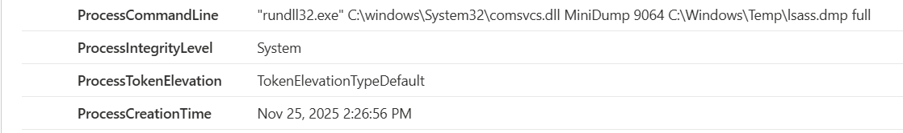
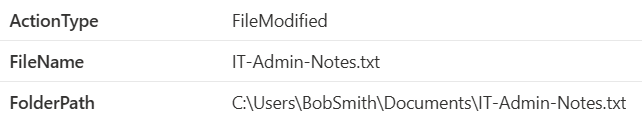

## Advanced Hunting (KQL) – Validating XDR

Once I had the story, I used KQL to validate the details.  
Here are my queries and their results.

## LSASS MiniDump 

```kql
DeviceProcessEvents
| where FileName =~ "rundll32.exe"
| where ProcessCommandLine contains "MiniDump"
```


---

## Reconnaissance Commands (whoami, hostname)
```kql
DeviceProcessEvents
| where ProcessCommandLine matches regex @"(whoami|hostname)"
```
  
---

## Sensitive File Access (IT-Admin-Notes.txt / export.txt)
```kql
DeviceFileEvents
| where FileName == "IT-Admin-Notes.txt" or FileName == "export.txt"
```


---

